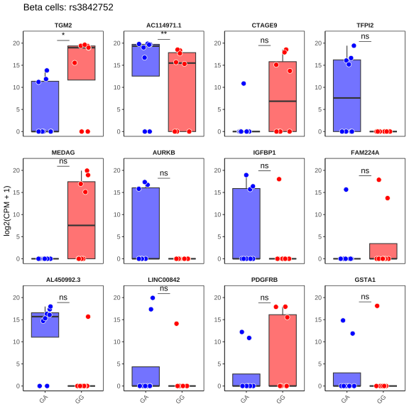

```{r include=FALSE}
knitr::opts_chunk$set(
    collapse = TRUE,
    warning = FALSE,
    message = FALSE
)
```

::: {.callout-tip}
## Citation

René van Tienhoven, Denis O’Meally, Tristan A. Scott, Kevin V. Morris, John C. Williams, John S. Kaddis, Arnaud Zaldumbide, and Bart O. Roep. "Genetic Protection from Type 1 Diabetes Resulting from Accelerated Insulin mRNA Decay." *Cell*, March 19, 2025.

:::

::: {.callout-note icon=false appearance="minimal"}

**Figure 3** *INS* expression and differential gene expression in human beta cells with the protective or susceptible *INS* variants

(A) Nascent and mature *INS* expression in beta cells with *INS*<sup>P/S</sup> (blue) or *INS*<sup>S/S</sup> (red). Violin plots show median expression values. Statistical analysis using linear mixed-effects models (with donor as a random effect) showed no significant differences (ns) between variants for either nascent or mature *INS* expression.
(B) Correlation between beta-cell stress score and *INS* RNA expression. Scatter plot shows individual cells (*INS*<sup>S/S</sup>, red and *INS*<sup>P/S</sup>, blue) with fitted linear regression line and 95% confidence interval bands. *INS* expression levels inversely associate with beta-cell stress markers in beta cells with *INS*<sup>P/S</sup> only. Correlations for beta cells with *INS*<sup>P/S</sup> versus *INS*<sup>S/S</sup> were significantly different from each other (p < 0.001).
(C) Volcano plot of differentially expressed genes between *INS*<sup>P/S</sup> or *INS*<sup>S/S</sup>, showing genes with higher expression in *INS*<sup>S/S</sup> (red) or *INS*<sup>P/S</sup> (blue).
(D) Expression levels of top differentially expressed genes *TGM2* and *AC114971.1* across donors. Box plots show median, quartile, and range of log2-normalized expression values for *INS*<sup>S/S</sup> (red) or *INS*<sup>P/S</sup> (blue) donors. Asterisks indicate statistical significance by Wilcoxon rank-sum test after multiple comparison correction.

:::

```{r }
#| code-fold: true
#| code-summary: "Setup"
# Required packages:
# dplyr, downloadthis, ggplot2, ggblend, ggdist, ggrepel, ggsignif, ggpubr, glue, here, knitr,
# Seurat, showtext, stringr, targets, tibble, tidyseurat
# Load packages
library(tidyseurat)
require(showtext)

# Configure showtext
font_add_google(name = "Roboto", family = "Roboto")
font_add_google(name = "Roboto Condensed", family = "Roboto Condensed")
showtext_auto()
showtext_opts(dpi = 300)

# Load via targets
targets::tar_config_set(store = here::here("_targets"))
targets::tar_load(seurat_object_lognorm_annotated)
# Could also load the object directly
# seurat_object_lognorm_annotated <- qs::qread("data/seurat_object_lognorm_annotated.qs")

targets::tar_source(here::here("R"))

seurat_object <- seurat_object_lognorm_annotated
seurat_object <- seurat_object |>
    dplyr::filter(diabetes_status == "NODM") |>
    dplyr::filter(grepl(bmim_donor_ids, orig.ident))
```

## A. Nascent & mature *INS*
```{r }
beta_cell_metadata <- seurat_object[[]] |>
    as.data.frame() |>
    tibble::rownames_to_column(var = "cell") |>
    dplyr::filter(cell_type == "Beta")

# Data prep for plot
plot_data <- beta_cell_metadata |>
    dplyr::mutate(
        mature_counts_INS = spliced_counts_INS_hk,
        nascent_INS = unspliced_counts_INS_hk,
        log_mature_INS = mature_counts_INS,
        log_nascent_INS = nascent_INS,
        protected_status = ifelse(protected, "Protected", "Susceptible")
    )

# Order the orig.ident factor levels
plot_data$orig.ident <- factor(
    plot_data$orig.ident,
    levels = plot_data |>
        dplyr::arrange(protected_status, orig.ident) |>
        dplyr::pull(orig.ident) |>
        unique()
)
```

```{r}
#| fig-width: 12
# Prepare data for plot
individual_cell_data <- plot_data |>
    dplyr::select(
        protected_status,
        log_mature_INS,
        log_nascent_INS,
        orig.ident,
        technology,
        tissue_source
    ) |>
    tidyr::pivot_longer(
        cols = c(log_mature_INS, log_nascent_INS),
        names_to = "expression_type",
        values_to = "expression"
    ) |>
    dplyr::mutate(
        expression_type = factor(
            ifelse(expression_type == "log_mature_INS", "Mature", "Nascent"),
            levels = c("Nascent", "Mature")
        ),
        protected_status = factor(
            protected_status,
            levels = c("Protected", "Susceptible")
        )
    ) |>
    dplyr::filter(!is.infinite(expression) & !is.na(expression))

# Function to run mixed model and extract p-value
run_mixed_model <- function(data) {
    full_model <- lme4::lmer(
        expression ~ protected_status + (1 | orig.ident),
        data = data
    )
    null_model <- lme4::lmer(expression ~ 1 + (1 | orig.ident), data = data)
    lrt_result <- stats::anova(null_model, full_model)
    p_value <- lrt_result$`Pr(>Chisq)`[2]
    return(p_value)
}

# Function to convert p-value to asterisks
p_to_asterisk <- function(p) {
    if (p <= 0.001) {
        return("***")
    } else if (p <= 0.01) {
        return("**")
    } else if (p <= 0.05) {
        return("*")
    } else {
        return("ns")
    }
}

# Run mixed models and get p-values
p_values <- individual_cell_data |>
    dplyr::group_by(expression_type) |>
    dplyr::summarise(
        p_value = run_mixed_model(dplyr::cur_data()),
        asterisk = p_to_asterisk(p_value),
        .groups = "drop"
    )

# Create annotation data
annotation_data <- data.frame(
    expression_type = factor(
        c("Nascent", "Mature"),
        levels = c("Nascent", "Mature")
    ),
    y_position = c(12.2, 12.2),
    xmin = c(1.15, 1.15),
    xmax = c(1.85, 1.85),
    annotation = p_values$asterisk
)

# Create individual cell plot
individual_cell_plot <- ggplot2::ggplot(
    individual_cell_data,
    ggplot2::aes(x = protected_status, y = expression, fill = protected_status)
) +
    ggplot2::coord_cartesian(clip = "off") +
    ggplot2::geom_violin(
        position = ggplot2::position_dodge(width = 0.8),
        width = 0.7,
        alpha = 0.5
    ) +
    ggplot2::geom_jitter(
        position = ggplot2::position_jitterdodge(
            dodge.width = 0.8,
            jitter.width = 0.3
        ),
        size = 0.5,
        alpha = 0.1,
        ggplot2::aes(color = protected_status)
    ) +
    ggplot2::facet_wrap(~expression_type, scales = "fixed", shrink = FALSE) +
    ggplot2::scale_fill_manual(
        values = c("Protected" = "blue", "Susceptible" = "red")
    ) +
    ggplot2::scale_color_manual(
        values = c("Protected" = "blue", "Susceptible" = "red")
    ) +
    ggplot2::scale_y_continuous(
        expand = ggplot2::expansion(mult = c(0, 0.1)),
        limits = c(0, 16)
    ) +
    ggdist::theme_ggdist() +
    ggplot2::theme(
        legend.position = "none",
        plot.title = ggtext::element_markdown(size = 16),
        axis.text.y = ggplot2::element_text(size = 12),
        axis.title.y = ggplot2::element_text(size = 12),
        axis.line.y = ggplot2::element_line(color = "black"),
        axis.line.x = ggplot2::element_line(color = "black"),
        axis.ticks.x = ggplot2::element_blank(),
        axis.text.x = ggplot2::element_blank(),
        axis.title.x = ggplot2::element_blank(),
        plot.margin = ggplot2::margin(r = 20, b = 10, l = 10, t = 10),
        strip.text = ggplot2::element_text(size = 14),
        strip.background = ggplot2::element_rect(colour = NA, fill = NA),
        panel.border = ggplot2::element_rect(fill = NA, color = NA)
    ) +
    ggplot2::labs(
        title = "INS expression in <span style='color:blue;'>protected</span> and <br><span style='color:red;'>susceptible</span> Beta cells",
        y = "Log-normalized counts"
    ) +
    ggplot2::geom_segment(
        data = annotation_data,
        ggplot2::aes(x = xmin, xend = xmax, y = y_position, yend = y_position),
        inherit.aes = FALSE
    ) +
    ggplot2::geom_text(
        data = annotation_data,
        ggplot2::aes(x = 1.5, y = y_position, label = annotation),
        inherit.aes = FALSE,
        vjust = -0.5
    ) +
    ggplot2::stat_summary(
        fun = median,
        geom = "label",
        ggplot2::aes(label = sprintf("%.2f", ggplot2::after_stat(y))),
        color = "white",
        alpha = 0.8,
        size = 3.75,
        hjust = -0.25,
        vjust = -0.5
    )
# Save the plot
ggplot2::ggsave(
    "figures/fig3a.svg",
    individual_cell_plot,
    width = 4,
    height = 4,
    create.dir = TRUE
)
knitr::include_graphics("figures/fig3a.svg")
```

[<i class="bi bi-filetype-svg"></i> Download Vector Image](figures/fig3a.svg){download="fig3a.svg"}

## B. Beta cell stress & *INS* expression

```{r }
#| fig-width: 7
#| fig-height: 7
plot_data <- seurat_object[[]] |>
    tibble::rownames_to_column(var = "cell") |>
    dplyr::select(
        cell,
        orig.ident,
        diabetes_status,
        protected,
        cell_type,
        INS_hk,
        cellular_stress_score
    ) |>
    dplyr::filter(cell_type == "Beta") |>
    dplyr::filter(INS_hk > 0L) |>
    dplyr::mutate(
        protected = dplyr::if_else(protected == TRUE, "1", "0"),
        alpha_value = dplyr::if_else(protected == "0", 0.30, 0.10),
        protected = as.factor(protected)
    )

plot <- ggplot2::ggplot(
    plot_data,
    ggplot2::aes(x = INS_hk, y = cellular_stress_score, partition = protected)
) +
    ggplot2::ggtitle("") +
    ggplot2::geom_point(
        ggplot2::aes(color = protected, fill = protected),
        shape = 21L,
        size = 6L,
        colour = "white",
        alpha = plot_data$alpha_value,
        show.legend = FALSE
    ) *
        (ggblend::blend("lighten") + ggblend::blend("multiply", alpha = 1L)) +
    ggplot2::geom_smooth(
        ggplot2::aes(group = protected, colour = protected, fill = protected),
        fullrange = FALSE,
        color = "white",
        size = 3.5,
        method = "lm",
        formula = y ~ x,
        level = 0.95,
        alpha = .10,
        show.legend = FALSE
    ) +
    ggplot2::geom_smooth(
        ggplot2::aes(group = protected, colour = protected, fill = protected),
        fullrange = FALSE,
        size = 2.5,
        method = "lm",
        formula = y ~ x,
        alpha = 0.10,
        show.legend = TRUE
    ) +
    ggplot2::theme(
        aspect.ratio = 1L / 1L,
        strip.text.x = ggplot2::element_text(size = 18L),
        strip.background = ggplot2::element_blank(),
        strip.placement = "outside",
        legend.title = ggplot2::element_blank(),
        legend.position = "none",
        legend.text = ggplot2::element_blank(),
        axis.line.x = ggplot2::element_line(colour = "black"),
        axis.line.y = ggplot2::element_line(colour = "black"),
        panel.grid.major = ggplot2::element_blank(),
        panel.grid.minor = ggplot2::element_blank(),
        panel.background = ggplot2::element_blank(),
        panel.border = ggplot2::element_blank(),
        plot.title = ggplot2::element_text(
            size = 16L,
            color = "black",
            face = "bold",
            hjust = 0.5
        ),
        axis.title.y = ggplot2::element_text(
            size = 35,
            color = "black",
            margin = ggplot2::margin(r = 15)
        ),
        axis.title.x = ggplot2::element_text(
            size = 35,
            color = "black",
            margin = ggplot2::margin(t = 15)
        ),
        axis.text.x = ggplot2::element_text(
            size = 30,
            color = "black",
            vjust = 0,
            hjust = 0.5
        ),
        axis.text.y = ggplot2::element_text(
            size = 30,
            color = "black",
            vjust = 0.5,
            hjust = 0.0
        )
    ) +
    ggplot2::scale_fill_manual(values = c("0" = "red", "1" = "blue")) +
    ggplot2::scale_color_manual(
        labels = c("Susceptible", "Protected"),
        values = c("0" = "red", "1" = "blue")
    ) +
    ggplot2::scale_x_continuous(
        limits = c(5L, 21L),
        breaks = c(5L, 10L, 15L, 20L),
        labels = c("5", "10", "15", "20")
    ) +
    ggplot2::scale_y_continuous(expand = ggplot2::expansion(mult = c(0L, 0L))) +
    ggplot2::labs(
        color = "protected",
        x = expression(italic("INS") ~ "RNA expression"),
        y = "Beta cell stress score"
    ) +
    ggplot2::coord_cartesian(ylim = c(-0.01, 0.61)) +
    ggplot2::guides(fill = "none") +
    ggplot2::annotate("text", x = 13L, y = 0.55, label = "p<0.001", size = 6L)
ggsave(
    filename = "figures/fig3b.svg",
    plot = plot,
    device = svg,
    width = 8L,
    height = 8L
)
knitr::include_graphics("figures/fig3b.svg")
```

[<i class="bi bi-filetype-svg"></i> Download Vector Image](figures/fig3b.svg){download="fig3b.svg"}

## C. Volcano plot

```{r }
bulk <- Seurat::AggregateExpression(
    seurat_object,
    return.seurat = TRUE,
    assays = "RNA",
    group.by = c("cell_type", "orig.ident", "rs3842752_consensus")
) |>
    tidyr::separate(
        .cell,
        into = c("cell_type", "orig.ident", "rs3842752_consensus"),
        sep = "_",
        remove = FALSE
    )

beta.bulk <- subset(bulk, cell_type == "Beta")

Seurat::Idents(beta.bulk) <- "rs3842752_consensus"

de_markers <- Seurat::FindMarkers(
    beta.bulk,
    ident.1 = "GA", # case/numerator
    ident.2 = "GG", # control/denominator
    test.use = "DESeq2",
    verbose = F,
    pseudocount.use = 0.001,
    min.pct = 0.25
)

de_markers$gene <- rownames(de_markers)
```

```{r }
#| code-summary: "Download DE Genes"
beta_cell_table <- as.data.frame(beta.bulk@assays$RNA$counts) |>
    dplyr::rename_with(
        ~ stringr::str_replace(., "Beta_", ""), # Remove the "Beta_" prefix
        dplyr::starts_with("Beta_")
    ) |>
    tibble::rownames_to_column("gene") |>
    tidyr::pivot_longer(
        cols = -gene,
        names_to = "full_id",
        values_to = "counts"
    ) |>
    dplyr::mutate(
        orig.ident = stringr::str_extract(full_id, "HPAP-\\d+"),
        rs3842752_consensus = stringr::str_extract(full_id, "_[A-Z]+$") |>
            stringr::str_remove("_")
    ) |>
    dplyr::select(-full_id) |>
    dplyr::left_join(de_markers, by = "gene")

# Download
de_markers |>
    dplyr::select(c(
        "gene",
        "avg_log2FC",
        "pct.1",
        "pct.2",
        "p_val_adj",
        "p_val"
    )) |>
    dplyr::mutate(significant = p_val_adj < 0.05 & abs(avg_log2FC) >= 1) %>%
    dplyr::arrange(dplyr::desc(significant), dplyr::desc(abs(avg_log2FC))) |>
    tibble::as_tibble() |>
    downloadthis::download_this(
        output_name = "differential_expression_rs3842752",
        output_extension = ".xlsx",
        button_label = "Download DESeq2 results",
        button_type = "success",
        has_icon = TRUE,
        icon = "fa fa-save"
    )
```

```{r }
#| fig-width: 7
#| fig-height: 7
rs3842752_volcano_plot <- volcano_plot(
    .data = de_markers,
    .transcripts = "gene",
    pvalue = "p_val",
    FDR = "p_val_adj",
    FDR_cutoff = 0.05,
    log2FoldChange = "avg_log2FC",
    log2FoldChange_cutoff = 1,
    title = "Beta cells: rs3842752",
    subtitle = "Upregulated in susceptible (<- GG) v protected (GA ->) beta cells",
)
ggplot2::ggsave(
    "figures/fig3c.svg",
    rs3842752_volcano_plot,
    width = 4,
    height = 4
)
knitr::include_graphics("figures/fig3c.svg")
```

[<i class="bi bi-filetype-svg"></i> Download Vector Image](figures/fig3c.svg){download="fig3c.svg"}

## D. Top genes

```{r }
#| fig-width: 7
#| fig-height: 7
pal <- c("GA" = "blue", "GG" = "red")

rs3842752_sig_genes_plot <- sig_genes_plot(beta_cell_table,
    title = "Beta cells: rs3842752",
    .abundance = "counts",
    .transcript = "gene",
    .sample = "orig.ident",
    FDR = "p_val_adj",
    logFC = "avg_log2FC",
    fill_palette = "pal",
    group_by = "rs3842752_consensus",
    normalization = "CPM",
    n_genes = 12
)
ggplot2::ggsave("figures/fig3d.svg", rs3842752_sig_genes_plot, width = 8L, height = 8L)

```

[<i class="bi bi-filetype-svg"></i> Download Vector Image](figures/fig3d.svg){download="fig3d.svg"}
