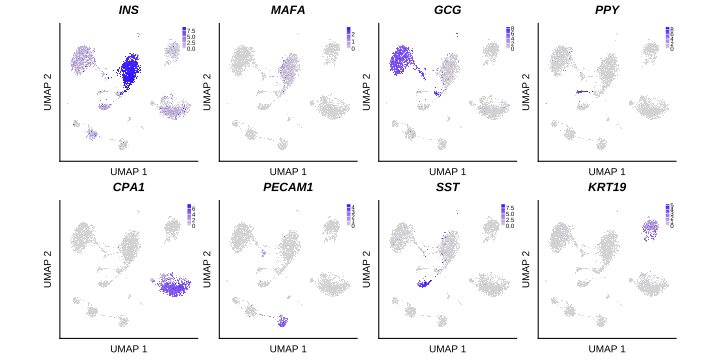
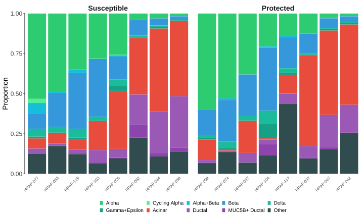

```{r include=FALSE}
knitr::opts_chunk$set(
    collapse = TRUE,
    warning = FALSE,
    message = FALSE
)
```

::: {.callout-tip}
## Citation

René van Tienhoven, Denis O’Meally, Tristan A. Scott, Kevin V. Morris, John C. Williams, John S. Kaddis, Arnaud Zaldumbide, and Bart O. Roep. "Genetic Protection from Type 1 Diabetes Resulting from Accelerated Insulin mRNA Decay." *Cell*, March 19, 2025.

:::

::: {.callout-note icon=false appearance="minimal"}

**Figure S2** UMAP visualization and proportion of cell types in single-cell transcriptomes, related to Figure 3

(A) UMAP visualization of cell types in non-diabetic pancreatic islets. Each point represents a single cell, and colors denote different cell types.
(B) Feature plots showing the expression of key genes across cell types. Each plot represents the expression level of a single gene (*INS*, *SST*, *GCG*, *PPY*, *MAFA*, *CPA1*, *PECAM1*, and *KRT19*) mapped to the UMAP coordinates. Intensity indicates the level of gene expression.
(C) Stacked bar plot showing proportions of cell types for individual donors, separated into those carrying the susceptible (left) and protected (right) *INS* variant. Each bar represents a donor, with colors proportional to cell type counts. Donors are ordered by decreasing proportion of alpha cells within each group. “Other” includes endothelial, mast, stellate, immune, and unassigned cells.

:::

```{r }
#| code-fold: true
#| code-summary: "Setup"
# Required packages:
# dplyr, ggplot2, ggtext, grid, here, knitr, patchwork, Seurat, showtext, stats, targets
# Load tidyseurat
library(tidyseurat)
# Configure showtext
require(showtext)
font_add_google(name = "Roboto", family = "Roboto")
font_add_google(name = "Roboto Condensed", family = "Roboto Condensed")
showtext_auto()
showtext_opts(dpi = 300)

targets::tar_config_set(store = here::here("_targets"))
targets::tar_source(here::here("R"))

targets::tar_load(seurat_object_lognorm_annotated)
seurat_object <- load_seurat(seurat_object_lognorm_annotated)
seurat_object <- seurat_object |>
    dplyr::filter(diabetes_status == "NODM") |>
    dplyr::filter(grepl(bmim_donor_ids, orig.ident))
```


### A. Cell type

```{r}
#| fig-cap: "Supplementary figure S2A: UMAP of cell types"
#| fig-alt: "UMAP of cell types"
#| fig-width: 5

plot_a <- seurat_object |>
    dplyr::filter(!is.na(elgamal_cell_type)) |>
    Seurat::DimPlot(
        group.by = "elgamal_cell_type",
        label = FALSE,
        cols = cell_type_palette,
        reduction = "umap",
        raster = FALSE,
        seed = 42
    ) +
    Seurat::NoLegend() +
    ggplot2::labs(x = "UMAP 1", y = "UMAP 2", title = NULL) +
    ggplot2::theme(
        axis.text.x = ggplot2::element_blank(),
        axis.text.y = ggplot2::element_blank(),
        axis.ticks = ggplot2::element_blank()
    ) +
    ggplot2::coord_fixed(ratio = 1)

# Apply LabelClusters
plot_a <- Seurat::LabelClusters(
    plot = plot_a,
    id = "elgamal_cell_type",
    box.padding = 0.4,
    size = 3,
    box = TRUE,
    repel = TRUE,
    cols = cell_type_palette
)

ggplot2::ggsave(here::here("figures/figS2a.svg"), plot_a, width = 5, create.dir = TRUE)
knitr::include_graphics("figures/figS2a.svg")
```

### B. Feature plots

```{r}
#| fig-width: 5
#| fig-cap: "Supplementary figure S2B: Feature plots of genes of interest"
#| fig-alt: "Feature plots of genes of interest"

genes_of_interest <- c("INS", "MAFA", "GCG", "PPY", "CPA1", "PECAM1", "SST", "KRT19")

plot_b <- Seurat::FeaturePlot(seurat_object,
    features = genes_of_interest,
    keep.scale = "feature",
    reduction = "umap",
    ncol = 4,
    raster = TRUE,
) &
    ggplot2::theme(
        plot.title = ggplot2::element_text(size = 12, face = "bold.italic"),
        plot.margin = grid::unit(c(0.1, 0.1, 0.1, 0.1), "cm"),
        axis.title = ggplot2::element_text(size = 10),
        axis.text.x = ggplot2::element_blank(),
        axis.text.y = ggplot2::element_blank(),
        axis.ticks = ggplot2::element_blank(),
        legend.position = c(0.99, 0.98),
        legend.justification = c(1, 1),
        legend.box.just = "right",
        legend.margin = ggplot2::margin(1, 1, 1, 1),
        legend.key.size = grid::unit(1, "cm"),
        legend.text = ggplot2::element_text(size = 6, margin = ggplot2::margin(l = 1, unit = "pt")),
        legend.title = ggplot2::element_blank()
    ) &
    ggplot2::labs(x = "UMAP 1", y = "UMAP 2") &
    ggplot2::coord_fixed(ratio = 1) &
    ggplot2::guides(color = ggplot2::guide_colorbar(barwidth = 0.25, barheight = 1.5))

ggplot2::ggsave(here::here("figures/figS2b.svg"), plot_b, width = 10)

```

### C. Cell type proportions

```{r}
#| fig-cap: "Supplementary figure S2C: Cell type proportions"
#| fig-alt: "Cell type proportions"
#| fig-width: 10
#| fig-height: 6

plot_data <- seurat_object[[]]

# Define the desired order for cell types
cell_type_order <- c(
    "Alpha", "Cycling Alpha", "Alpha+Beta", "Beta", "Delta",
    "Gamma+Epsilon", "Acinar", "Ductal", "MUC5B+ Ductal", "Other"
)

plot_data_modified <- plot_data |>
    dplyr::filter(diabetes_status == "NODM") |>
    dplyr::group_by(orig.ident, cell_type, protected) |>
    dplyr::summarise(count = n(), .groups = "drop") |>
    dplyr::group_by(orig.ident) |>
    dplyr::mutate(prop = count / sum(count)) |>
    dplyr::ungroup() |>
    dplyr::mutate(cell_type = factor(cell_type, levels = cell_type_order))

# Calculate alpha cell proportion for each donor
alpha_proportions <- plot_data_modified |>
    dplyr::filter(cell_type == "Alpha") |>
    dplyr::select(orig.ident, protected, alpha_prop = prop)

# Join alpha proportions back to the main dataset
plot_data_modified <- plot_data_modified |>
    dplyr::left_join(alpha_proportions, by = c("orig.ident", "protected"))

# Create donor order based on alpha cell proportion within each protected group
donor_order <- plot_data_modified |>
    dplyr::arrange(protected, desc(alpha_prop), orig.ident) |>
    dplyr::distinct(protected, orig.ident) |>
    dplyr::group_by(protected) |>
    dplyr::mutate(donor_order = dplyr::row_number()) |>
    dplyr::ungroup()

# Join the donor order back to the main dataset
plot_data_modified <- plot_data_modified |>
    dplyr::left_join(donor_order, by = c("orig.ident", "protected"))

plot_c <- ggplot2::ggplot(
    plot_data_modified,
    ggplot2::aes(x = reorder(orig.ident, donor_order), y = prop, fill = cell_type)
) +
    ggplot2::geom_bar(stat = "identity") +
    ggplot2::scale_fill_manual(values = cell_type_palette) +
    ggplot2::labs(
        y = "Proportion"
    ) +
    ggplot2::theme_classic() +
    ggplot2::theme(
        axis.text.x = ggtext::element_markdown(angle = 45, hjust = 1, vjust = 1, size = 8),
        axis.text.y = ggplot2::element_text(size = 12),
        axis.title.y = ggplot2::element_text(size = 14),
        axis.ticks.x = ggplot2::element_blank(),
        axis.line.x = ggplot2::element_blank(),
        axis.title.x = ggplot2::element_blank(),
        strip.text = ggplot2::element_text(size = 14, face = "bold"),
        strip.background = ggplot2::element_blank(),
        panel.spacing = grid::unit(0.5, "lines"),
        plot.title = ggplot2::element_text(size = 18, face = "bold"),
        legend.position = "bottom",
        legend.key.size = grid::unit(0.5, "lines"),
        legend.title = ggplot2::element_blank(),
        legend.text = ggplot2::element_text(size = 10),
        legend.box = "horizontal"
    ) +
    ggplot2::guides(fill = ggplot2::guide_legend(title = "Cell Type", nrow = 2, byrow = TRUE)) +
    ggplot2::facet_grid(~protected,
        scales = "free_x", space = "free_x",
        labeller = ggplot2::as_labeller(c(`TRUE` = "Protected", `FALSE` = "Susceptible"))
    ) +
    ggplot2::scale_y_continuous(expand = c(0, 0))

ggplot2::ggsave(here::here("figures/figS2c.svg"), plot_c, width = 10, height = 6)

```

### Combined

```{r}
#| fig-height: 10
#| fig-cap: "Supplementary figure S2: Combined plot of cell type proportions and feature plots"
#| fig-alt: "Combined plot of cell type proportions and feature plots"

# Create the patchwork plot
plot_d <- (plot_a / plot_b / plot_c) +
    patchwork::plot_layout(heights = c(1, 1, 0.5))

ggplot2::ggsave("figures/figS2.svg", plot_d, height = 10)
knitr::include_graphics("figures/figS2.svg")
```

[<i class="bi bi-filetype-svg"></i> Download Vector Image](figures/figS2.svg){download="figures/figS2.svg"}
